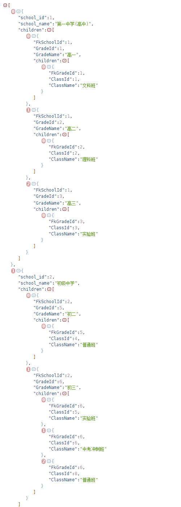
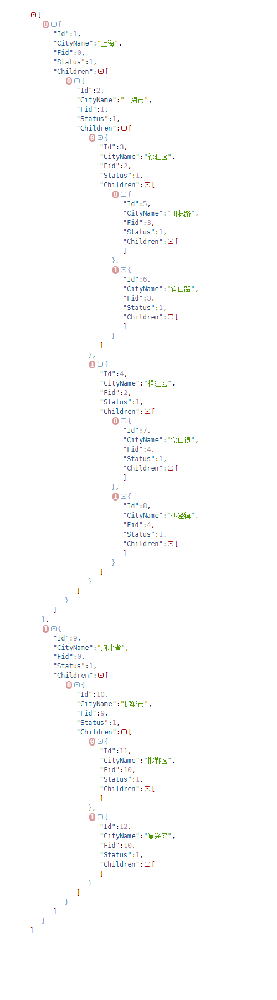

## SQL 查询结果快速树形化  

### 前言  
>   1.针对sql查询结果,进行树形化,支持指定层级深度、无限层级深度的数据树形化.  
>   2.本包搭配 gorm sql查询结果扫描函数 Scan Find ,将获取的结果直接传递给本包，可以非常方便快捷地进行数据的树形化.  
 

###  核心树形化扫描函数    
>  1.核心函数，只有一个 ScanToTreeData(inSqlSlice, &dest)    
>  2.使用非常简单,就跟 gorm 的 Scan、Find函数类似，定义一个接受树形结果的结构体切片，传入地址,坐等接受结果.  

### 集成到任何项目  
```code  
# 安装前请自行在tag标签查询最新版本，本次我们以 v1.0.0为例

# 安装此包
go   get  github.com/qifengzhang007/sql_res_to_tree@v1.0.0

#调用sql结果树形化扫描函数， &dest  为接受树形结果的结构体切片，定义方式参考相关的单元测试示例代码  
sql_res_to_tree.CreateSqlResFormatFactory().ScanToTreeData(inSqlSlice, &dest);

```
###  使用方法  
[sql结果无限级树形化](./test/dataToTree2_test.go)  

[sql结果有限级且支持个性化设置子结构体字段树形化](./test/dataToTree2_test.go)  

###  效果图  
>1.有限层级的数据,按照每一层拥有不同字段的结构体树形化,原始数据如下：  
实现方法:[详细实现过程](./test/dataToTree_test.go)
```code   
[
	{SchoolId:1 SchoolName:第一中学(高中) FkSchoolId:1 GradeId:1 GradeName:高一 FkGradeId:1 ClassId:1 ClassName:文科班} 
	{SchoolId:1 SchoolName:第一中学(高中) FkSchoolId:1 GradeId:2 GradeName:高二 FkGradeId:2 ClassId:2 ClassName:理科班} 
	{SchoolId:1 SchoolName:第一中学(高中) FkSchoolId:1 GradeId:3 GradeName:高三 FkGradeId:3 ClassId:3 ClassName:实验班} 

	{SchoolId:2 SchoolName:初级中学 FkSchoolId:2 GradeId:5 GradeName:初二 FkGradeId:5 ClassId:4 ClassName:普通班}

	{SchoolId:2 SchoolName:初级中学 FkSchoolId:2 GradeId:6 GradeName:初三 FkGradeId:6 ClassId:5 ClassName:实验班} 
	{SchoolId:2 SchoolName:初级中学 FkSchoolId:2 GradeId:6 GradeName:初三 FkGradeId:6 ClassId:6 ClassName:中考冲刺班}
]
```
> 2.使用本包函数 ScanToTreeData(inSqlSlice, &dest),直接将 dest 变量json化结果：  
  


>2.无限层级的数据(结构体自己嵌套自己)树形化,原始数据如下：  
实现方法:[详细实现过程](./test/dataToTree2_test.go)  

```code   
[
{id:1 CityName:上海      Fid:0   STATUS:1 Remark:上海(一级节点)}
    {id:2 CityName:上海市      Fid:1   STATUS:1 Remark:上海市(二级节点)}
	  {id:3 CityName:徐汇区      Fid:2   STATUS:1 Remark:""}
	    {id:5 CityName:田林路      Fid:3   STATUS:1 Remark:"街道"}
	    {id:6 CityName:宜山路      Fid:3   STATUS:1 Remark:"街道"}

	{id:4 CityName:松江区      Fid:2   STATUS:1 Remark:""}
	    {id:7 CityName:佘山      Fid:4   STATUS:1 Remark:""}
	    {id:8 CityName:泗泾镇      Fid:4   STATUS:1 Remark:""}

    {id:9 CityName:河北省      Fid:0   STATUS:1 Remark:""}
	    {id:10 CityName:邯郸市      Fid:9   STATUS:1 Remark:"二级城市节点"}
	      {id:11 CityName:邯山区      Fid:10   STATUS:1 Remark:"市区划分"}
	      {id:12 CityName:复兴区      Fid:10   STATUS:1 Remark:"市区划分"}
]
```
> 2.使用本包函数 ScanToTreeData(inSqlSlice, &dest),直接将 dest 变量json化结果：  
  

